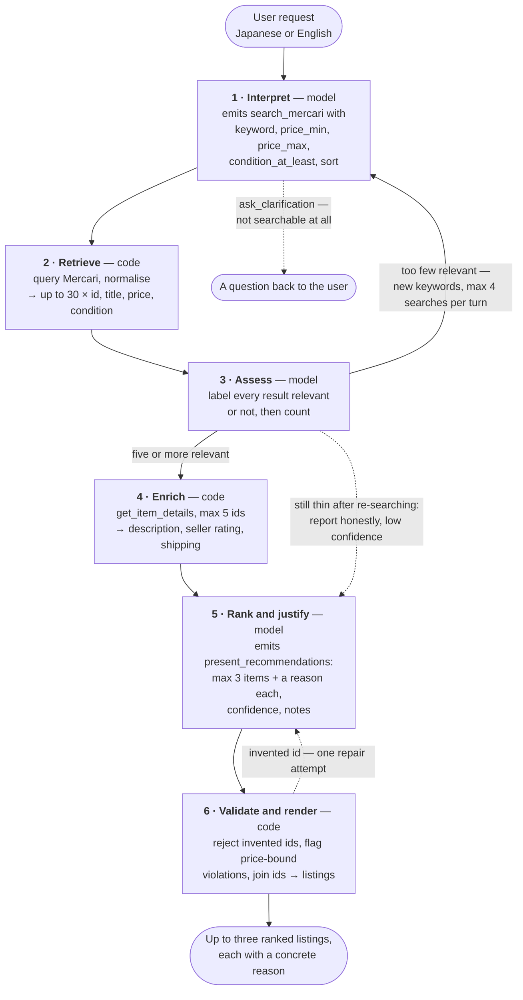
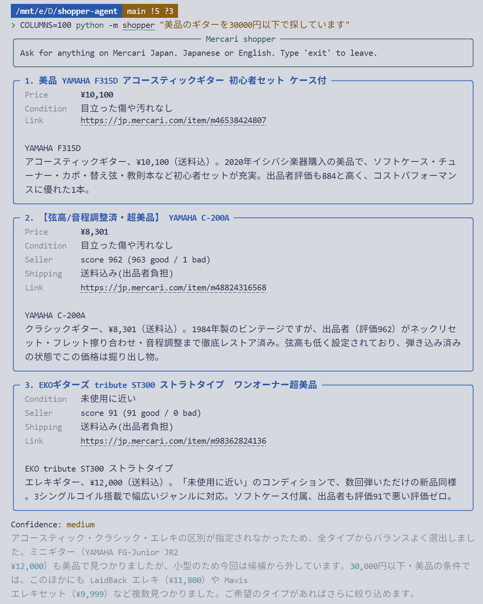

# Mercari Japan AI Shopper

A command-line shopping assistant for [Mercari Japan](https://jp.mercari.com).
You describe what you want in plain Japanese or English; it turns that into a
structured Mercari search, judges whether the results are actually relevant,
and returns up to three ranked listings with a concrete reason for each one.

---

## Overview

One request moves through six stages. They alternate between the model and
ordinary code, and the same six numbers are used everywhere below — in the
worked example, the diagram, the message trace, and the failure table.

| # | Stage | Who | Tool |
|---|---|---|---|
| 1 | **Interpret** — request → search parameters | model | `search_mercari` |
| 2 | **Retrieve** — parameters → listings | code | — |
| 3 | **Assess** — are these results actually relevant? | model | — |
| 4 | **Enrich** — shortlist → descriptions, seller stats | code | `get_item_details` |
| 5 | **Rank and justify** — details → three ranked reasons | model | `present_recommendations` |
| 6 | **Validate and render** — check, join, display | code | — |

Stages 1, 3 and 5 are the model. Stages 2, 4 and 6 are deterministic
functions. That split holds throughout: **all judgement lives in the model;
everything else is a deterministic function.** `MercariClient` never sees the
user's sentence, and never decides whether a listing is a good match.

`ask_clarification` is the fourth tool and sits outside the spine — it is an
exit from stage 1 for requests that cannot be searched at all.

### The pipeline



The dotted edges are the interesting ones. They are the paths that exist
because the agent is allowed to fail honestly rather than always produce three
listings.

### The same request, concretely

```
User: 美品のギターを30000円以下で探しています
      ("a guitar in great condition, under ¥30,000")

 1  Interpret
      search_mercari { keyword:            "ギター アコースティック",
                       price_max:          30000,
                       condition_at_least: "like_new" }

 2  Retrieve
      Each raw hit is trimmed from ~20 fields to the 6 that can change a
      ranking decision. 30 listings go back to the model.

 3  Assess
      The model labels each result relevant or not and counts them. Nine
      are relevant, so it proceeds instead of re-searching.

 4  Enrich
      get_item_details on four shortlisted ids → seller descriptions,
      ratings, shipping terms.

 5  Rank and justify
      present_recommendations with three listings, a reason citing
      something concrete about each, confidence "medium", and the
      assumptions it made in notes.

 6  Validate and render
      The id → listing join happens locally, against the listings we
      actually retrieved. An id the model invented is caught here and
      never reaches the user.
```

### The loop, and what accumulates in it

```
messages = [user turn]
repeat:
    response = LLM(system_prompt, tool_schemas, messages)
    append the assistant turn verbatim
    for each tool_use block: execute it, collect a tool_result
    append all tool_results as one user message
    stop when a terminal tool succeeds, or the model stops calling tools
```

Every stage leaves a message behind, and the history is what carries state
from one stage to the next — there is no separate state object. After a clean
run the list looks like this:

```
  user       "美品のギターを30000円以下で"
  assistant  [ text, tool_use search_mercari ]            ← stage 1
  user       [ tool_result: 30 listings, 3 searches left ]← stage 2
  assistant  [ text, tool_use get_item_details ]          ← stages 3, 4
  user       [ tool_result: 4 details, 0 failures ]
  assistant  [ tool_use present_recommendations ]         ← stage 5
  user       [ tool_result: delivered ]
```

Note that stage 3 leaves no tool call of its own. It happens in the assistant
turn between retrieving and enriching, which is exactly why the system prompt
has to force it to produce evidence — see
[Stage 3: Assess](#stage-3-assess).

Three things about this loop are easy to get wrong; see
[The message history is the state](#3-the-message-history-is-the-state).

### Where each stage can fail

The stage numbering is also the debugging index. Every run appends typed
events to `traces/YYYY-MM-DD.jsonl`, keyed by run id, so a bad answer can be
attributed to a stage rather than guessed at.

| # | What goes wrong | Where it shows up |
|---|---|---|
| 1 | keyword misses the market's vocabulary; a stated budget is dropped; a condition is invented | the `search_mercari` arguments in the trace, against the original request |
| 2 | transport failure, rate limiting | typed errors — `NetworkError`, `RateLimitError` — rather than one undifferentiated pile |
| 3 | irrelevant fallback results accepted as genuine matches | search count and final `confidence`; **the failure mode this system is built around** |
| 4 | a listing sells between search and detail fetch | per-id entries in the tool result's `errors` — expected, not exceptional |
| 5 | padding to three, generic reasons, an invented id | `unknown_ids` and price-bound warnings emitted at validation |
| 6 | — | deterministic; this stage is the net, not a source of error |

Stages 1 and 5 are also the two natural units for offline evaluation: stage 1
has a checkable answer for price and condition, and stage 5 can be checked
against the structured records the recommendation claims to describe.

---

## Setup

Requires Python 3.10 or later.

```bash
git clone https://github.com/konami0328/Mercari-shopper-agent.git
cd Mercari-shopper-agent

python -m venv .venv
source .venv/bin/activate          # Windows: .venv\Scripts\activate

pip install -r requirements.txt
```

Create a `.env` file in the project root:

```dotenv
ANTHROPIC_API_KEY=sk-ant-...
ANTHROPIC_MODEL=claude-sonnet-4-5
```

`ANTHROPIC_MODEL` is required and has no default. A hardcoded fallback would
fail as a runtime 404 on the first request, three modules from the mistake.

Verify the install without spending an API call — the smoke test replaces both
the model and the data layer with scripted fakes, so it needs no key and no
network:

```bash
python smoke_test_client.py
```

| Package | Why it is here |
|---|---|
| `mercapi` | Mercari access. Handles the request signing the site requires. |
| `httpx` | Used directly only to classify transport errors into our taxonomy. |
| `anthropic` | Official SDK. Tool calling is used directly. |
| `rich` | Terminal rendering. |
| `python-dotenv` | Loads `.env` during development. |

---

## Usage

Interactive — the REPL exists because clarification is inherently a two-turn
exchange: the agent asks, you answer, and the answer has to land in the same
conversation.

```bash
python -m shopper
```

One-shot:

```bash
python -m shopper "5000円以下のスニーカー"
python -m shopper "Looking for a mechanical keyboard under 10000 yen"
```

| Flag | Default | Effect |
|---|---|---|
| `--mode {live,record,replay}` | `live` | `record` saves each response; `replay` serves only from saved ones. |
| `--searches N` | `4` | Maximum `search_mercari` calls per user turn (the stage 3 → 1 loop). |
| `--limit N` | `30` | Listings shown to the model per search. |
| `--verbose` | off | Print token counts, LLM calls and latency after each turn. |

### Example session



> The screenshot above was produced against a DeepSeek endpoint via
> `ANTHROPIC_BASE_URL`, using the same Anthropic SDK and tool-calling code
> path shown here.

### Reproducible runs

Mercari's inventory changes constantly, so two runs of the same query on
different days differ for reasons that have nothing to do with the agent.
`--mode record` saves every response to disk; `--mode replay` serves only from
those files and raises `FixtureMissingError` on a call that was never
recorded, because a run that is half online and half offline is not a
reproducible run.

This freezes stage 2, not stage 1: the same sentence can produce slightly
different search parameters between runs, which changes the cache key and
misses. Run at `temperature=0` to keep that drift down.

---

## Design Choices

### Three system-wide decisions

#### 1. The model judges, the code does not

Stages 1, 3 and 5 are the model. Stages 2, 4 and 6 are plain functions with no
model in them. `MercariClient` never sees the user's sentence and never
decides whether a listing is a good match. Given the same arguments it returns
the same thing every time.

This is what makes the system debuggable. Anything that changes between two
runs of the same query is the model; anything that does not is code. When an
answer is wrong, that line tells you which half to look at.

#### 2. The final answer is a tool call that does nothing

`present_recommendations` and `ask_clarification` have no side effects. They
exist so the model's last act is a structured object instead of a paragraph.

The model returns only listing ids and reasons. Everything shown to the user —
price, condition, seller rating, link — is looked up locally from the listings
we retrieved. So an id the model made up is simply an id that is not in that
set, and it gets caught before the user sees it. Checking "did it recommend
something it never retrieved" is one line of Python instead of reading prose.

It also means `confidence` and `notes` are required fields rather than
something the model might forget to mention.

#### 3. The message history is the state

There is no separate state object. Each stage leaves a message behind and the
next stage reads it. That keeps the loop short, but three things about it
break in ways that are hard to trace back:

- The assistant turn goes into the history exactly as it came back, text
  blocks included. Stage 3 happens in those text blocks, so filtering them out
  throws away the reasoning.
- One assistant turn can hold several `tool_use` blocks. Each one needs a
  `tool_result`, and all of them go into a single user message.
- This applies to the closing tools too. A `tool_use` with no matching
  `tool_result` makes the API reject the history on the *next* turn. It shows
  up as a 400 the first time someone asks a second question, far from the code
  that caused it. So a closing call that arrives alongside a search call is
  still executed and answered before the loop returns.

### Stage by stage

#### Stage 1: Interpret

**Some things are kept away from the model on purpose.** It cannot set the
result `limit`, which is our context budget rather than a user need, or the
sale `status`, since we never show sold items. It also gets no "filter" or
"rank" tool, because filtering and ranking are the reasoning being tested.
Handing it a ranking tool would move the interesting part into our code.

**`condition_at_least` is a threshold, not a set.** Mercari's API wants a set
of accepted condition ids. Users think in thresholds: "at least in decent
shape". The tool takes one boundary and expands it. That removes a whole class
of mistakes where the model picks the right worst case but forgets to include
everything above it.

**The `sort` parameter carries a warning in its own description.** Sorting by
price ascending on Mercari brings up cheap accessories and junk, not cheap
examples of the thing you asked for. So the description says so, and tells the
model to keep the default sort and set `price_max` instead. Found by probing,
written where the model will actually read it.

**The bar for asking a question is set high.** `ask_clarification` is allowed
once per conversation, and only when searching would be pure guesswork: no
identifiable product, or a category spanning orders of magnitude with no
budget given. Otherwise the model assumes something reasonable, searches, and
writes the assumption into `notes`. A shopping assistant that opens with three
questions is worse than one that makes a sensible guess and says what it
guessed.

#### Stage 2: Retrieve

**An unofficial API client instead of HTML scraping.** Mercari does not
publish a product API for outside developers. `mercapi` is a community client
for the private API that Mercari's own app calls, and it handles the request
signing that needs. It returns structured JSON, so there are no page selectors
to break when the markup changes and no browser to run.

The cost is real. This depends on an interface with no compatibility promise,
and Mercari can break it without notice. A production version should use an
authorised channel. What we can control is our own behaviour: requests are
spaced a second apart, and transport failures are sorted into named errors
(`NetworkError`, `RateLimitError`, `ItemNotFoundError`) rather than retried
blindly.

**Record and replay.** Inventory changes daily, so the same query gives
different results on different days. In `record` mode every response is saved
to disk; in `replay` mode nothing touches the network, and a call that was
never recorded raises rather than quietly falling back. A run that is half
online and half offline is not reproducible, so failing loudly is the point.

#### Stage 3: Assess

This is the most important decision in the project.

While building the data layer I searched for deliberate nonsense — strings
matching no real product. Mercari does not return zero results. It returns
listings that look exactly like real matches: same fields, plausible titles,
nothing marking them as filler. There is no way to tell a failed search from a
good one by looking at the data.

That killed a mechanism that was already written. The original plan was for
the agent to see an empty result set and decide whether to loosen its
constraints and try again. That trigger will almost never fire.

So detecting a failed search had to move into the model, as a step with no
tool of its own. The system prompt works around four problems:

1. **The evidence is not in the data.** So the prompt replaces "decide whether
   these results are good" with something mechanical: label every result
   relevant or not, then count them.
2. **The model has no sense of how many good results is normal.** So the
   prompt supplies a number. Fewer than five relevant means the search failed,
   not that the market is empty.
3. **Admitting the search failed means contradicting its own earlier work,**
   which models are reluctant to do. So the prompt states plainly that
   returning fewer than three listings, or none, is a correct answer.
4. **A wrong judgement here is invisible to the user.** One bad recommendation
   is obvious. Three confidently wrong ones are not. So `confidence` is a
   required field.

The number five in (2) is a guess. Checking it is the single most useful thing
an evaluation harness could do.

#### Stage 4: Enrich

**Partial failure is the normal case, not an exception.** Listings sell out
constantly, so by the time we fetch details for five ids, one or two may be
gone. Failing the whole call would throw away good data. Dropping the missing
ones silently would leave the model believing it saw details it never got. So
the tool returns what succeeded, lists what failed, and tells the model not to
retry those ids.

#### Stage 5: Rank and justify

**Every reason has to point at something specific in that listing** — the
price against the stated budget, the condition, a line from the seller's
description, the seller's rating. "Good quality, great value" could be written
about anything, so the tool description rules it out.

**Returning fewer than three listings is a correct outcome,** and both the
prompt and the tool description say so. Because Mercari always returns
something, padding the list to three costs nothing and being honest costs
work. The prompt has to push against that.

#### Stage 6: Validate

Two kinds of problem, handled differently.

**Hard problems get one repair attempt.** An id that never appeared in a
search result means the recommendation describes a listing that does not
exist. The model gets the payload back once, with an explanation and a chance
to fix it.

**Soft problems become warnings.** If a recommended listing costs more than
the `price_max` the model itself searched with, the user should see that, but
it is not worth spending another turn on. It says something about the model's
internal consistency rather than making the answer wrong.

### Budgets, which cut across every stage

**The tool schema is not a contract.** `maxItems` and parameter descriptions
guide the model, but the API does not reject a tool call that breaks its own
schema. So the limits are applied again in the executor, where they actually
bind, and `max_turns` in the loop catches anything the per-tool counters miss.

**Budgets reset every turn, not every conversation.** This started as a bug.
The counters lived on the executor, which lives as long as the agent, so by
the fourth question in a session every search was refused and the agent could
only apologise. Fixing it meant separating three lifetimes:

- **Reset each turn:** search, detail and repair counters, and the price
  bounds the model declared. A second question deserves a full allowance, and
  a price limit left over from an earlier, unrelated question would otherwise
  produce warnings about a constraint the user never set.
- **Kept:** the listings retrieved so far, because follow-ups refer back to
  them ("the second one, but cheaper"), and because they are what catches
  made-up ids.
- **Kept:** the clarification allowance, because the tool promises one
  question per conversation. Resetting it each turn would let the agent keep
  interrogating the user.

`smoke_test_client.py` has a regression test for this.

**Every error tells the model what to do next.** An error that only states the
problem invites the model to retry the same call until the turn budget is
gone. So each one carries an instruction: search budget exhausted means go to
`present_recommendations` with what you already have and lower your
confidence.

---

## Potential Improvements

**An evaluation harness, staged like the pipeline.** The groundwork is in
place — record/replay freezes stage 2, structured outputs make stage 5
checkable mechanically, and every run emits typed events. Three things worth
measuring, in descending order of value: whether the agent pads to three
listings when fewer genuinely fit, measured on deliberately obscure queries
(stage 3); whether stated reasons are faithful to the retrieved records, which
is checkable directly rather than by a judge (stage 5); and whether the "fewer
than five relevant" threshold is the right number (stage 3 again).

**Preference memory across turns.** The multi-turn transport already exists;
what is missing is carrying stated preferences forward, so "actually, cheaper"
does not require restating the original request.

**Listing images.** Mercari is a photo-driven marketplace, and condition
claims in text are frequently contradicted by the photographs. Scoring images
against the seller's description at stage 4 would catch a class of bad listing
that text alone cannot.

**Sold-listing comparison.** The client filters to on-sale items only. Sold
listings are the natural reference for "is this actually a good price?", which
is the question every shopper is really asking.

**Parallel detail fetching.** Stage 4 is sequential behind a shared throttle.
Bounded concurrency with a token-bucket limiter would cut the slowest part of
a turn without becoming a worse-behaved client.

**Category and brand filters.** Mercari's API exposes category and brand ids.
Exposing them would let stage 1 narrow structurally rather than by keyword
alone — at the cost of shipping an id mapping, which is why keywords came
first.