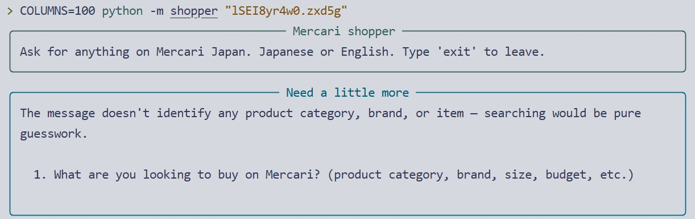

# Mercari Japan AI Shopper

A command-line shopping assistant for [Mercari Japan](https://jp.mercari.com).
You describe what you want in plain Japanese or English; it turns that into a
structured Mercari search, judges whether the results are actually relevant,
and returns up to three ranked listings with a concrete reason for each one.

---

## Overview

One request moves through six stages, alternating between the model and
ordinary code. These stage numbers are used throughout — in the diagram
below, and again in the evaluation table at the end.

| # | Stage | Who |
|---|---|---|
| 1 | **Interpret** — request → search parameters | model |
| 2 | **Retrieve** — parameters → listings | code |
| 3 | **Assess** — are these results actually relevant? | model |
| 4 | **Enrich** — shortlist → descriptions, seller stats | code |
| 5 | **Rank and justify** — details → three ranked reasons | model |
| 6 | **Validate and render** — check, join, display | code |

**All judgement lives in the model; everything else is a deterministic
function.** `MercariClient` never sees the user's sentence and never decides
whether a listing is a good match. No agent framework is used — the loop is a
single function in `agent.py`, and both it and the reasoning behind the split
are in [Design Choices](#design-choices).

The model acts through four tools. Three form the spine: `search_mercari`
at stage 1, `get_item_details` at stage 4, and `present_recommendations`,
which delivers the answer and ends the turn at stage 5. The fourth,
`ask_clarification`, sits outside it — an exit from stage 1 for requests
that cannot be searched at all.


Two things the diagram is making a point of. The dotted edges are the paths
that exist because the agent is allowed to fail honestly rather than always
produce three listings. And stage 3 has no tool call of its own — it happens
in the model's own text, between a search result arriving and the next call
being made, which is why the system prompt has to force it to produce
evidence. See
[Design Choices › It can tell you it found nothing](#it-can-tell-you-it-found-nothing).

---

## Setup

Requires Python 3.10 or later.

```bash
cd mercari-shopper-agent           # the unzipped directory

python -m venv .venv
source .venv/bin/activate          # Windows: .venv\Scripts\activate

pip install -r requirements.txt
```

| Package | Why it is here |
|---|---|
| `mercapi` | Mercari access. Handles the request signing the site requires. |
| `httpx` | Used directly only to classify transport errors into our taxonomy. |
| `anthropic` | Official SDK. Tool calling is used directly, with no framework on top. |
| `rich` | Terminal rendering. |
| `python-dotenv` | Loads `.env` during development. |

Create a `.env` file in the project root:

```dotenv
ANTHROPIC_API_KEY=sk-ant-...
ANTHROPIC_MODEL=claude-sonnet-4-5
```

`ANTHROPIC_MODEL` is required and has no default on purpose: a hardcoded
fallback that happens not to exist on the caller's key surfaces as a runtime
404 on the first request, three modules from the mistake.

Verify the install without spending an API call. The smoke test replaces both
the model and the data layer with scripted fakes, so it needs no key and no
network:

```bash
python smoke_test_client.py
```

It checks loop mechanics rather than answer quality: that budgets bind when
the model ignores them, that an invented listing id is rejected and repaired,
that a partial detail failure does not sink the run, and that every
`tool_use` block ends up with a matching `tool_result`.

---

## Usage

Interactive — the REPL exists because clarification is inherently a two-turn
exchange: the agent asks, you answer, and the answer has to land in the same
conversation.

```bash
python -m shopper
```

One-shot:

```bash
python -m shopper "5000円以下のスニーカー"
python -m shopper "Looking for a mechanical keyboard under 10000 yen"
```

| Flag | Default | Effect |
|---|---|---|
| `--mode {live,record,replay}` | `live` | `record` saves each response; `replay` serves only from saved ones. |
| `--searches N` | `4` | Maximum `search_mercari` calls per user turn (the stage 3 → 1 loop). |
| `--limit N` | `30` | Listings shown to the model per search. |
| `--verbose` | off | Print token counts, LLM calls and latency after each turn. |

### Example session


> **A note on the model.** The screenshot was produced against DeepSeek's
> model (DeepSeek v4 Pro), not Claude (due to region restriction) — reached by pointing
> `ANTHROPIC_BASE_URL` at DeepSeek's Anthropic-compatible endpoint and
> setting `ANTHROPIC_MODEL` to their model id. Everything else in the code
> path is unchanged: the official `anthropic` SDK, the Anthropic Messages
> API wire format, and the same tool-use logic documented here. There is
> no provider abstraction layer in this codebase — swapping the model is
> a one-line `.env` change; `config.py` is where that decision is
> recorded.

`--mode replay` needs saved responses (cassettes) recorded ahead of time,
and none are bundled with this submission. To try it, run a query once
under `--mode record` first. See
[Design Choices › Runs can be reproduced](#runs-can-be-reproduced-and-attributed-to-a-stage)
for what that mode is for.

---

## Design Choices

Each section is a capability, followed by the decisions that buy it.
Assumptions that have not been measured are marked as such.

### It can tell you it found nothing

Mercari's search matches *some* of the query terms, not all of them. Adding
constraints does not narrow the result set to listings that satisfy them all.
`mercari_probe.py` measures this across four query classes — run it with
`python mercari_probe.py`. Measured 2026-07-28; the inventory is live, so a
re-run will not reproduce the counts exactly.



| Class | Query shape | Non-empty | Counts |
|---|---|---|---|
| A | garbage ascii, tokenises to nothing | 0/3 | 0, 0, 0 |
| B | real words, impossible combination | 3/3 | 30, 16, 2 |
| C | multi-constraint, real product | 3/4 | 30, 0, 23, 16 |
| D | ordinary query (control) | 3/3 | 30, 30, 30 |

Two findings shape everything else:

**Result count carries no information about relevance.** `宇宙船 デニム`
("spaceship denim") filled a full page of 30, one term matching a
space-print T-shirt and the other a pair of jeans. `ローランド SH-101 ブルー
完動品 元箱付き` — a real product, plainly described — returned zero.

**Partial matches are indistinguishable from good ones.** `エルメス バーキン
25 ヒマラヤ 新品未使用` returned an Hermès *bracelet* at ¥420,800: right
brand, right colourway, wrong product category. `ライカ M3 ダブルストローク
1954年 前期型` returned M3 bodies with the wrong shutter mechanism and the
wrong year. `リーバイス 501 1947年 デッドストック` returned a 501XX
reproduction. Every field is well-formed; nothing marks any of them as
satisfying only part of the request.

Two consequences:

- The planned "empty result → loosen constraints → retry" mechanism does not
  hold as a general trigger. Empty sets do occur (class A), but the more
  common failure is a full page of partial matches that a count alone cannot
  distinguish from a good result.
- Relevance judgement moves entirely into the model, as a step with no tool
  of its own. Only the system prompt can enforce it.

The prompt targets four specific weaknesses:

| Weakness | Countermeasure |
|---|---|
| The evidence is not in the data | Label each result relevant or not, then count. Mechanical, not a holistic judgement |
| No prior for normal result density | Threshold supplied: fewer than 5 relevant means the search failed. Re-query with different keywords. This also covers the empty case — zero results is zero relevant |
| Admitting failure contradicts its own earlier work | Prompt states that returning fewer than 3 listings, or none, is correct; padding is a failure |
| A wrong global judgement is invisible to the user | `confidence` is a required field |

The prompt's trap list — reproductions sold as originals (復刻, レプリカ,
LVC), bundles when one item was wanted (まとめ売り), accessories or parts
when the main product was wanted, wrong sizes or models — predates this
measurement; it came from probing during earlier data-layer work. The probe
corroborates two of those categories directly (the 501XX reproduction, the
Leica's wrong shutter mechanism and year) but does not cleanly fit a third:
the Hermès bracelet matches on brand and colourway while missing product
category entirely, a failure shape the current trap list does not name.

`ask_clarification` is capped at once per conversation and reserved for
requests that cannot be searched at all — no identifiable product, or a
category spanning orders of magnitude with no budget. Otherwise: assume,
search, record the assumption in `notes`.

**Unvalidated.** The threshold of 5 is a guess, as is the ranking priority
(condition > seller rating > seller-paid shipping). The retrieval behaviour
above is measured; these two are not, and neither has been tuned against a
result. See [Potential Improvements](#potential-improvements).

### The final answer is a structured object, not prose

`present_recommendations` and `ask_clarification` execute and do nothing. They
have no side effects. Their only purpose is to make the model's last act a
schema-shaped object.

The model returns listing ids and reasons. Price, condition, seller rating and
link are joined locally from the listings retrieved during the run. That gives:

- **Invented ids are mechanically detectable** — an id not in the retrieved
  set. One line of Python, no prose parsing.
- **Rank is the array order.** The model orders `items` best-first; no code
  reorders. The criteria sit in the system prompt as prose, not as weights in
  a scoring function.
- **`confidence` and `notes` are required fields**, so uncertainty and
  assumptions cannot be dropped silently.
- **Reasons must cite something specific** to that listing — price against the
  stated budget, condition, a line from the description, seller rating.
  Enforced in the tool description.

Validation splits by severity:

| Problem | Handling |
|---|---|
| Id never returned by any search | Hard. Payload goes back to the model once for repair (`max_validation_retries = 1`) |
| Listing exceeds the `price_max` the model itself searched with | Soft. Warning shown to the user; no extra turn spent |

### Retrieval fails in named ways

**`mercapi`, not HTML scraping.** Mercari publishes no product API for outside
developers. `mercapi` is a community client for the private API the Mercari
app itself calls, and handles its request signing. It returns structured JSON:
no page selectors to break on a redesign, no browser to drive.

The tradeoff is real — no compatibility promise, and Mercari can break it
without notice. A production system needs an authorised channel. What is
controllable:

- Requests spaced 1 second apart by a shared throttle.
- Transport failures translated into a named taxonomy: `RateLimitError`
  (HTTP 429), `NetworkError` (other wire failures), `ItemNotFoundError`
  (listing gone).
- Sold listings filtered in the client rather than exposed as a parameter.
- `get_item_details` treats partial failure as normal: returns what
  succeeded, lists the ids that failed, tells the model not to retry them.

### A second question works

No separate state object. The message history is the state.

```
messages = [user turn]
repeat:
    response = LLM(system_prompt, tool_schemas, messages)
    append the assistant turn verbatim
    for each tool_use block: execute it, collect a tool_result
    append all tool_results as one user message
    stop when a terminal tool succeeds, or the model stops calling tools
```

One user turn in, then exactly two messages per round trip:

```
user       "美品のギターを30000円以下で"
assistant  [ text, tool_use search_mercari ]
user       [ tool_result: 30 listings, 3 searches left ]
assistant  [ text, tool_use get_item_details ]
user       [ tool_result: 4 details, 0 failures ]
assistant  [ tool_use present_recommendations ]
user       [ tool_result: delivered ]
```

Two things bite only on the second question:

- **The assistant turn is appended verbatim, text blocks included.** The
  relevance assessment described above lives in those blocks. Filtering down
  to tool
  calls discards it.
- **Every `tool_use` needs a matching `tool_result`, closing tools included.**
  An unanswered block makes the API reject the history on the *next* turn — a
  400 far from its cause. The loop answers every block before deciding to stop.

Three lifetimes are kept separate:

| Scope | What | Why |
|---|---|---|
| Reset each turn | search / detail / repair counters, declared price bounds | A new question deserves a full allowance; a stale bound warns about a constraint the user never set |
| Kept | listings retrieved so far | Follow-ups refer back to them, and they are what catches invented ids |
| Kept | clarification allowance | The tool promises one question per conversation |

`smoke_test_client.py` has a regression test for the per-turn reset and for
the retained listings.

### Cost is bounded even when the model misbehaves

A tool schema is not a contract: the API does not reject a call that violates
its own schema. Limits are enforced in three places.

| Layer | Where | Binding? |
|---|---|---|
| Tool schema | `build_tool_schemas` | No — guidance only |
| Executor counters | `ToolExecutor` | Yes, per tool |
| Turn cap | the loop in `agent.py` | Yes, overall |

Per-tool counters matter beyond limiting totals: without them the model could
spend every turn searching and never fetch a detail, leaving the turn cap to
end a run that never looked at a product. Defaults are 4 searches, 2 detail
calls of at most 5 ids each, and 8 turns.

Every error carries a next step. An error that only states the problem invites
retrying it until the budget is gone, so "search budget exhausted" also says
to proceed to `present_recommendations` and lower confidence. Three
consecutive tool failures end the run.

### Runs can be reproduced, and attributed to a stage

Mercari's inventory is alive, so the same query differs day to day for reasons
unrelated to the agent.

- `--mode record` saves every response; `--mode replay` serves only from those
  files and raises on a miss rather than falling back. A run that is half
  online and half offline is not reproducible.
- Freezing the data does not freeze the model. The same sentence can produce
  slightly different parameters, changing the cassette key and missing. The
  agent runs at `temperature = 0`.
- The cassette key excludes client-side-only parameters such as `limit`, so
  one recording serves every context-size setting.

Attribution rests on the model/code split: the model interprets, assesses and
ranks; the code retrieves, enriches, validates and renders, and returns the
same thing every time for the same arguments. Anything that differs between
two runs of one query is the model.

Every run appends typed events to `traces/YYYY-MM-DD.jsonl` keyed by run id:
LLM calls with token counts and latency, tool calls with arguments and an
error flag, data-layer calls with cache state.

This is infrastructure, not measurement. See
[Potential Improvements](#potential-improvements) for what I would measure
with it.

---

## Potential Improvements

**An evaluation harness, staged like the pipeline.** Nothing here has been
run. The groundwork exists — record/replay freezes the data, `temperature = 0`
removes most sampling drift, the terminal tools return machine-checkable
objects, and typed traces attribute every call to a stage. Stage isolation is
the point: a wrong keyword at stage 1 guarantees a bad ranking at stage 5, so
scoring stage 5 on that run measures nothing about ranking.

| Stage | What to measure | Method |
|---|---|---|
| 1 Interpret | Are price, condition and keyword extracted correctly? | Fixed request set with hand-written expected parameters, spanning Japanese, English, misspelled English and multi-constraint requests. Exact match on `price_*` and `condition_at_least`; substring match on `keyword` against a list of acceptable Japanese terms — equality produces false failures on spacing and on synonyms that retrieve equally well (`デニム` / `ジーンズ`) |
| 2 Retrieve | Is `--limit 30` a recall ceiling? | Sweep the limit against recorded cassettes and check whether the eventually-chosen listing ever sits beyond position 30. If it does, every downstream metric is measuring the wrong candidate pool |
| 3 Assess | Does it pad to three when few listings genuinely fit? | Requests for things Mercari has little of, replayed from cassettes. Report the fraction of runs returning three anyway, and whether `confidence` drops when the pool is thin. Sweeping the threshold of 5 against the same set replaces that guess with a number |
| 4 Enrich | — | Deterministic. Per-id failures are already reported in the tool result |
| 5 Rank | Does the order follow the criteria the prompt states? | The prompt is the specification, so no external label set is needed. Two checks: a weighted utility score computed from the retrieved records, compared against the agent's ordering; and a differential test — hold the cassette fixed, change only the stated priority ("cheapest" versus "best condition"), and assert the order changes. A ranking that does not move is not ranking |
| 6 Validate | — | Deterministic |

Stages 3 and 5 both rest on judging relevance, so a single mislabelled query
set would move both numbers in the same direction.

**Trim the conversation history.** Every turn resends the entire history,
including the full 30-listing payload from every earlier search. Nothing is
summarised or dropped, so by the fourth question the request carries three
stale result sets the model will never look at again. Extracting the user's
stated preferences into a small structured record, and discarding the raw
listings behind it, would cut input tokens and give follow-up turns something
steadier to read than the whole transcript.

**Category and brand filters.** The probe in
[Design Choices › It can tell you it found nothing](#it-can-tell-you-it-found-nothing)
found a request for an Hermès Birkin returning an Hermès *bracelet*: the search matched the brand and
the colourway and ignored the product type entirely. `mercapi` accepts
`categories`, `brands`, `sizes` and `exclude`, none of which the agent
currently uses. A category filter would have dropped the bracelet before the
model ever saw it, and `exclude` would remove `復刻` reproductions at the
source rather than asking the model to spot them. The cost is a stored id
mapping, which is why keywords came first.